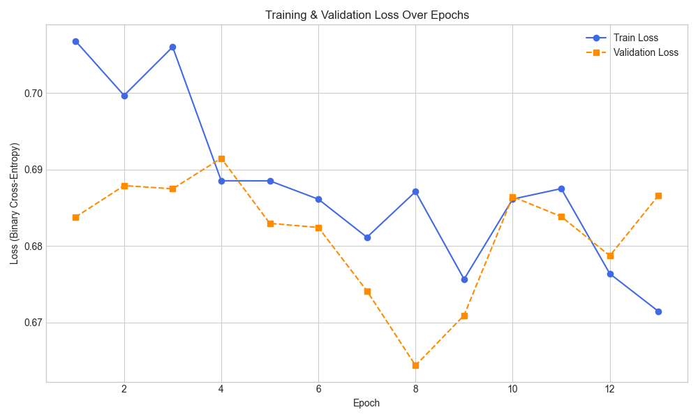
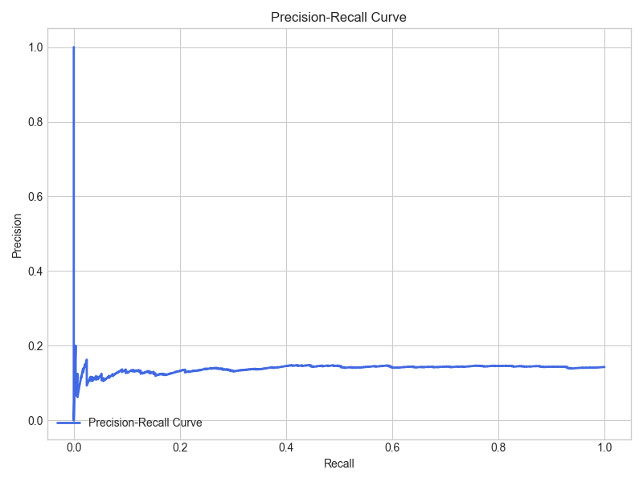

# QMTRY — Lending Club Loan Default Risk Model

---

## Project Overview
This project develops a deep learning classifier to predict whether a Lending Club loan (2007–2015) will default (`not.fully.paid = 1`).  
It addresses the challenges of highly imbalanced financial datasets, directly applicable to healthcare payment denial prediction.

---

## Objectives
- Perform exploratory data analysis (EDA) to understand the dataset.  
- Preprocess categorical and numeric features for modeling.  
- Handle class imbalance with weighted sampling.  
- Build and train a deep learning model with BatchNorm and Dropout.  
- Use early stopping and learning rate scheduling.  
- Evaluate with ROC-AUC, Precision-Recall, Confusion Matrix.  
- Save artifacts (model, metrics, plots) for reproducibility.  
- Automatically update this README with the latest results.

---

## Domain Context
- **Finance:** loan default prediction, credit risk management.  
- **Healthcare parallel:** denial prediction in revenue cycle.  
- **Audit-ready:** reproducible `.py` pipelines, tracked metrics, versioned artifacts.

---

## Dataset Description
| Feature            | Description                                                                 |
|--------------------|-----------------------------------------------------------------------------|
| `credit.policy`    | 1 if meets Lending Club underwriting criteria, 0 otherwise                  |
| `purpose`          | Loan purpose (credit_card, debt_consolidation, educational, etc.)           |
| `int.rate`         | Interest rate (e.g., 0.11 for 11%)                                          |
| `installment`      | Monthly loan installment amount                                             |
| `log.annual.inc`   | Log of borrower annual income                                               |
| `dti`              | Debt-to-income ratio                                                        |
| `fico`             | FICO credit score                                                           |
| `days.with.cr.line`| Days borrower has had a credit line                                         |
| `revol.bal`        | Revolving balance                                                           |
| `revol.util`       | Revolving utilization rate                                                  |
| `inq.last.6mths`   | Creditor inquiries in last 6 months                                         |
| `delinq.2yrs`      | Times 30+ days delinquent in last 2 years                                   |
| `pub.rec`          | Derogatory public records                                                   |
| `not.fully.paid`   | Target → 1 if loan not fully paid (default), 0 otherwise                    |

---

## Methodology
### Phase 1 – EDA
- Class balance  
- Distribution of FICO scores and interest rates  
- Correlation heatmap  
All plots saved in `docs/eda/`

### Phase 2 – Preprocessing
- Encode `purpose` with LabelEncoder  
- Scale numerical features with StandardScaler  
- Save processed data to `data/loan_data_processed.csv`

### Phase 3 – Modeling
- Neural Net with BatchNorm and Dropout  
- WeightedRandomSampler for imbalance  
- Optimizer: Adam, Loss: BCELoss  
- Learning rate schedule: CosineAnnealingLR  
- Early stopping on validation ROC-AUC

### Phase 4 – Evaluation
- Metrics: ROC-AUC, Recall, Precision, F1, Confusion Matrix  
- Curves: ROC and Precision-Recall  
- Plots saved in `models/`

### Phase 5 – Documentation
- Training curves (loss, ROC-AUC, LR schedule) generated by `plot_curves.py`  
- README auto-updated to embed plots

---

## Results & Plots

### Training and Validation Loss

### ROC-AUC Over Epochs

### Precision-Recall Curve

### Learning Rate Schedule

---

## Repository Structure

qmtry-loan-default-risk-model/
│
├── data/ # raw & processed datasets
├── docs/eda/ # EDA plots
├── models/ # saved model + metrics + plots
├── notebooks/ # optional Jupyter exploration
├── src/ # source scripts
│ ├── eda.py
│ ├── preprocessing.py
│ ├── train.py
│ ├── evaluate.py
│ ├── plot_curves.py
│ └── model.py
│
├── README.md
└── requirements.txt

---

## Deliverables
- `docs/eda/*.png` → EDA plots  
- `data/loan_data_processed.csv` → processed dataset  
- `models/loan_model.pt` → trained PyTorch model  
- `models/training_log.csv` → per-epoch metrics  
- `models/loan_default_loss_curve.png`, `loan_default_roc_curve.png`, `loan_default_pr_curve.png` → learning curves  

---

